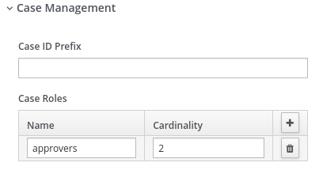
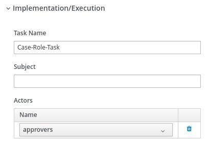

# Case management in version 7

Article that describe the new capabilities:

- [Case management - jBPM v7 - Part 1](http://mswiderski.blogspot.it/2016/10/case-management-jbpm-v7-part-1.html)
- [Case management - jBPM v7 - Part 2 - working with case data](http://mswiderski.blogspot.it/2016/10/case-management-jbpm-v7-part-2-working.html)
- [Case management - jBPM v7 - Part 3 - dynamic activities](http://mswiderski.blogspot.it/2016/10/case-management-jbpm-v7-part-3-dynamic.html)
- [Order IT hardware - jBPM 7 case application](http://mswiderski.blogspot.it/2017/01/order-it-hardware-jbpm-7-case.html)
- [case management security](http://mswiderski.blogspot.it/2017/02/jbpm-7-case-management-security.html)
- [Make use of rules to drive your cases](http://mswiderski.blogspot.it/2017/07/make-use-of-rules-to-drive-your-cases.html)
- [Case management improvements - data authorisation](http://mswiderski.blogspot.com/2017/10/case-management-improvements-data.html)
- [Sub cases for case instance and ... process instance](http://mswiderski.blogspot.com/2017/10/sub-cases-for-case-instance-and-process.html)
- [Case management - mention someone in comments](http://mswiderski.blogspot.com/2017/11/case-management-mention-someone-in.html)
- [Track your processes and activities with SLA](http://mswiderski.blogspot.com/2018/02/track-your-processes-and-activities.html)
- [React to SLA violations in cases](http://mswiderski.blogspot.com/2018/02/react-to-sla-violations-in-cases.html)


## Project 

To change a normal project in case management one change the following features in `kie-deployment-descriptor.xml`:

- set runtime strategy to Per Case

        <runtime-strategy>PER_CASE</runtime-strategy>

- configure marshallers for case file and documents

        <marshalling-strategies>
            <marshalling-strategy>
                <resolver>mvel</resolver>
                <identifier>org.jbpm.casemgmt.impl.marshalling.CaseMarshallerFactory.builder().withDoc().get();</identifier>
                <parameters/>
            </marshalling-strategy>
            <marshalling-strategy>
                <resolver>mvel</resolver>
                <identifier>new org.drools.persistence.jpa.marshaller.JPAPlaceholderResolverStrategy("com.example:SimpleCase:1.0", classLoader)</identifier>
                <parameters/>
            </marshalling-strategy>
            <marshalling-strategy>
                <resolver>mvel</resolver>
                <identifier>new org.jbpm.document.marshalling.DocumentMarshallingStrategy();</identifier>
                <parameters/>
            </marshalling-strategy>
        </marshalling-strategies>

- create WIH definitions:

    In the deployment descriptor:

        <work-item-handlers>
            <work-item-handler>
                <resolver>mvel</resolver>
                <identifier>new org.jbpm.casemgmt.impl.wih.StartCaseWorkItemHandler(ksession);</identifier>
                <parameters/>
                <name>StartCaseInstance</name>
            </work-item-handler>
        </work-item-handlers>

    WorkDefinition.wid files in the project and its packages to ensure case related nodes (e.g. Milestone) are available in palette. Example of wid file:


          [
            "name" : "Milestone",
            "parameters" : [
              "Condition" : new StringDataType()
            ],
            "displayName" : "Milestone",org.kie.api.runtime.process.CaseData
            "icon" : "defaultmilestoneicon.png",
            "category" : "Milestone"
          ],
          
          [
            "name" : "StartCaseInstance",
            "parameters" : [
              "DeploymentId" : new StringDorg.kie.api.runtime.process.CaseDataataType(),
              "CaseDefinitionId" : new StringDataType(),
              "Data_" : new StringDataType(),
              "UserRole_" : new StringDataType(),
              "GroupRole_" : new StringDataType(),
              "DataAccess_" : new StringDataType(),
              "Independent" : new StringDataType(),
              "DestroyOnAbort" : new StringDataType()
            ],
            "results" : [
                "CaseId" : new StringDataType(),
            ],
            "displayName" : "Sub Case",
            "icon" : "defaultsubcaseicon.png",
            "category" : "Cases"
          ]

- add the case management project nature: in the root folder an empty file `.caseproject`

## Show case application

The show case application is a sample application to explore the case management capabilities.

To enable it:

- from `rhpam-<version>-add-ons.zip` extract `rhpam-<version>-case-mgmt-showcase-eap7-deployable.zip`
- deploy the war in your application server

It's possible to enable a direct link from BC to the show case app adding this property:

```java
org.jbpm.casemgmt.showcase.url=/rhpam-case-mgmt-showcase
```

The link will be available in the right top corner in the *grid* icon.

The user must have the `Administrators` role.

### Deploy Show case application in different EAP

- user registry should be the same of the kieserver (e.g. if you have the user `pamAdmin` in the kieserver you need the same in the application server that hosts the case application)
    
- make sure that the user has the role `user` defined

- add the following property:

```xml
<property name="org.kie.server.location" value="http://localhost:8080/kie-server/services/rest/server" />
```

- configure the KieLoginModule

```xml
<subsystem xmlns="urn:jboss:domain:security:2.0">
    <security-domains>
        <security-domain name="other" cache-type="default">
            <authentication>
                <login-module code="Remoting" flag="optional">
                    <module-option name="password-stacking" value="useFirstPass"/>
                </login-module>
                <login-module code="RealmDirect" flag="required">
                    <module-option name="password-stacking" value="useFirstPass"/>
                </login-module>
                <login-module code="org.kie.security.jaas.KieLoginModule" flag="optional" module="deployment.rhpam-case-mgmt-showcase.war" />
            </authentication>
```

## Process 

- adhoc true
- case id prefix

## Milestone

Milestones are triggered when a case file variable reach a specific state.
The variable MUST be declared case file, flag it in the process variable list.

**Condition** requires a Drool expression like in the following example:

    org.kie.api.runtime.process.CaseData(data.get("ok") == true)

In order to get a more readable expression:

1. At process level add this import: `org.kie.api.runtime.process.CaseData`
2. Leverage the **OOPath**

    import org.kie.api.runtime.process.CaseData
    
In this way the previous condition can be expressed as:

    CaseData(data["ok"] == true)

Handling complex data types:

```java
CaseData( $data : data["person1"] ) $p : Person( name == 'Jim' ) from $data
CaseData( $data : data["customerSupport"] ) CustomerSupport( customerEngaged ) from $data
```

OOPath does not work since it's not reactive - AVOID this:

```java
CaseData( $p : data['person1'], $p#Person.name == "Jim" )
```


## Case Roles

Case Roles simplify the dynamic role assignment, they work like variables, used at task creation time to identify the right user / group.

- create a case role for that process

  

- use the case role in the actors assignment:
  
  


## Case Role Assignment

Programmatic-ally:

Inside script:

```java
kcontext.getCaseAssignment().assignUser("approvers", "donato");
```

In a Java component:

```java
import org.jbpm.services.task.impl.model.GroupImpl;
import org.jbpm.services.task.impl.model.UserImpl;


caseService.assignToCaseRole(HR_CASE_ID, "contact", new UserImpl("mary"));
caseService.assignToCaseRole(HR_CASE_ID, "contact", new GroupImpl("HR"));
```

Assign the case owner to case role:

```java
CaseAssignment caseAssignment = kcontext.getCaseAssignment();

Collection<OrganizationalEntity> entities = caseAssignment.getAssignments("owner");

OrganizationalEntity owner = entities.iterator()
                                     .next();

CaseService caseService = (CaseService) ServiceRegistry.get()
                                                       .service(ServiceRegistry.CASE_SERVICE);
String caseId = ((CaseFileInstance)kcontext.getCaseData()).getCaseId();
caseService.assignToCaseRole(caseId, "consult", owner);
caseService.assignToCaseRole(caseId, "business", owner);
```

## Case Management Security

By default case instance security is enabled. It does protect each case instance from being seen by users who do not belong to a case in anyway. In other words, if you are not part of case role assignment (either assigned as user or a group member) then you won't be able to get access to the case instance.


Authorisation can also be turned off by system property: 

- `org.jbpm.cases.auth.enabled` when set to false.

Above access is just one part of the security for case instances. In addition, there is case instance operations that can be restricted to case roles. Here is the list of currently supported case instance operations that can be configured:

- CANCEL_CASE
- DESTROY_CASE
- REOPEN_CASE
- ADD_TASK_TO_CASE
- ADD_PROCESS_TO_CASE
- ADD_DATA
- REMOVE_DATA
- MODIFY_ROLE_ASSIGNMENT
- MODIFY_COMMENT

by default three of these operations:

- CANCEL_CASE
- DESTROY_CASE
- REOPEN_CASE
    CaseData ( data["decision"] == "AskForDetails" )
are protected with following roles:

- owner
- admin

again, these are case roles so based on case role assignments can differ between case instances. Thus allowing maximum flexibility in how to utilise them.

security for case operations is configurable via simple property file called `case-authorization.properties` that should be available at root of the class path upon start of the case application. Format of this file is extremely simple:

OPERATION=role1,role2,roleN

## Case service

Dependency:

```xml
<dependency>
    <groupId>org.jbpm</groupId>
    <artifactId>jbpm-services-api</artifactId>
    <scope>provided</scope>
</dependency>
<dependency>
    <groupId>org.jbpm</groupId>
    <artifactId>jbpm-case-mgmt-api</artifactId>
    <scope>provided</scope>
</dependency>
```

Use the case APIs:

```java
org.jbpm.casemgmt.api.CaseService caseService =  org.jbpm.services.api.service.ServiceRegistry.get().service(org.jbpm.services.api.service.ServiceRegistry.CASE_SERVICE);
caseService.triggerAdHocFragment(...);
```

## Case Rules

```java
import org.jbpm.casemgmt.api.model.instance.CaseFileInstance;


rule "ask user for details"
    when
        $caseData : CaseFileInstance()
        String(this == "AskForDetails") from $caseData.getData("decision")
    then
        $caseData.remove("decision");
        CaseService caseService = (CaseService) ServiceRegistry.get().service(ServiceRegistry.CASE_SERVICE);
        Map<String, Object> parameters = new HashMap<>();
        parameters.put("reason", "How did it happen?");
        caseService.addDynamicTask($caseData.getCaseId(), caseService.newHumanTaskSpec("Please provide additional details", "Action", "insured", null, parameters));
end
```

## Accessing to the case data from scripts

Variables in the case (process) definition that are flagged as **Case File** are special variables, in order to read and write them from scripts you cannot use the usual `kcontext.getVariable()` / `kcontext.setVariable(...)`.

This the correct approach:

```java
CaseData caseData = kcontext.getCaseData();

Data data = (Data) caseData.getData("data");
data.setPrice(data.getPrice() + 10);
caseData.add("data", data);
```

**Pay attention:** `caseData.add("data", data)` update the **caseFile** variable, but it DOES NOT triggers the rules (e.g. the Milestone condition).

To have a "full" caseFile update use the following snippet of code:

```java
RuntimeDataService runtimeDataService = (RuntimeDataService) ServiceRegistry.get().service(ServiceRegistry.RUNTIME_DATA_SERVICE);
ProcessInstanceDesc processInstanceDesc = runtimeDataService.getProcessInstanceById(kcontext.getProcessInstance().getId());
String correlationKey = processInstanceDesc.getCorrelationKey();
CaseService caseService = (CaseService) ServiceRegistry.get().service(ServiceRegistry.CASE_SERVICE);
caseService.addDataToCaseFile(correlationKey, "data", data);
```

Here an alternative approach to retrieve the case id from the context:

```java
String caseId = (String) kcontext.getCaseData().getData("caseId");
```

## Start a case from a process

This work item allows to be executed in independent mode which means once the case instance is started it will complete work item without waiting for case instance completion. 
In this scenario work item is completed with data taken from the case instance - data from case file plus case id at is stored under *CaseId* name in the result map.
If the work item is (as by default) in the dependent mode, this work item will not be completed until case instance completes - either being closed or canceled/destroyed.

Parameters:

 - *DeploymentId* - deployment id where that case definition belongs to (if not given deployment id of the work item will be used)
 - *CaseDefinitionId* - identifier of the case definition a new case instance should be started for
 - *Data_NAME* - case file data to be given when starting a case - NAME is the name of the case file input, can be given as many times as needed
 - *UserRole_NAME* - case role assignment as user entity where NAME is the name of the role that given user should be assigned to
 - *GroupRole_NAME* - case role assignment as group entity where NAME is the name of the role that given group should be assigned to
 - *DataAccess_NAME* - case file data access restriction where NAME is the name of the data that given roles should have access to, supports list of roles (comma separated)
 - *Independent* - indicates if the case instance is independent of the node that starts it - default is false
 - *DestroyOnAbort* - indicates if the case instance should be destroyed in case the work item is aborted, faults to true


## References

- [How to generate a custom case id](https://github.com/kiegroup/droolsjbpm-integration/tree/master/kie-server-parent/kie-server-tests/kie-server-integ-tests-case-id-generator)

# Case Management in BPM Suite version 6

In order to design a case you have to set **AdHoc** property to **true**.

To design adhoc activities you have to place them in an **adhoc subprocess**.


## Adhoc subprocess
An Ad-Hoc Sub-Process is a specialized type of Sub-Process that is a group of Activities that have no REQUIRED sequence relationships.

Properties:

- AdHocCompletionCondition

    the condition that once met the execution is considered successful and finishes

- AdHocCancelRemainingInstances

    if set to true, once the AdHocCompletionCondition is met, execution of any Elements is immediately cancelled.

In the designer the user has possibility to set 'AdHocOrdering' property for Ad Hoc Sub-Processes: parallel and sequential.
Nevertheless, core engine only supports parallel execution, property should be hidden in designer.

## Dependencies

Version 7.x:

```xml
    <dependency>
      <groupId>org.jbpm</groupId>
      <artifactId>jbpm-case-mgmt-api</artifactId>
      <scope>provided</scope>
    </dependency>
```

Version 6:

DO NOT import jbpm-case-mgmt in the pom but copy it in WEB-INF/lib!

## Coding

Reference

[CaseMgmtService](https://github.com/kiegroup/jbpm/blob/6.5.x/jbpm-case-mgmt/src/main/java/org/jbpm/casemgmt/CaseMgmtService.java)

### Trigger adhoc fragment

			CaseMgmtService caseMgmtService = new CaseMgmtUtil(engine);
			String[] adHocFragmentNames = caseMgmtService.getAdHocFragmentNames(646);
		
			for (String frag : adHocFragmentNames) {
				System.out.println(">>> "+frag);
			}
			caseMgmtService.triggerAdHocFragment(646, "Segreteria Prepara Pubblicazione");


### Start a dynamic task
org.jbpm.casemgmt.CaseMgmtService cmService = new org.jbpm.casemgmt.CaseMgmtUtil(kcontext);

java.util.Map<String, Object> workParams = new java.util.HashMap<String, Object>();

workParams.put("Message", testVar);


cmService.createDynamicWorkTask(kcontext.getProcessInstance().getId(), "Log", workParams);

